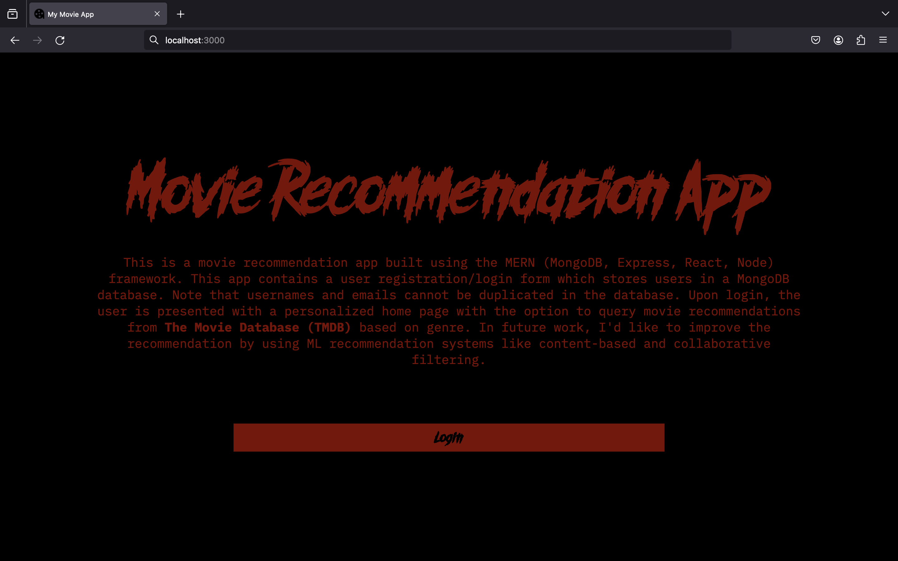

# Movie Recommendation App Frontend

This repository is the frontend for a movie recommendation app built using `React`.

The deployment link is available here: https://movie-app-frontend.up.railway.app/ .

The link to the backend repository is here: https://github.com/naviret/movie-app-backend . 

This app is composed of three web pages that follow the structure shown below.

```
.
├── /
├── /authenticate
└── /home/:user
```

This frontend makes use of the `react-browser-dom` to route components to the pages shown in the directory tree. Each url then renders the following pages:

```
.
├── /WebHomePage
├── /AuthenticatePage
│   ├── /Login
│   ├── /Register
│   └── /Forgot Password
└── /UserHomePage
```

## Using the app

### Home Page

The image shown below is the home page. This describes what the project is about and also provides a link to the Login page.



### Authentication Page

This page consists of a login, registration, and forgot password page as shown below.


The registration page verifies that the user's submission is correct by querying the attempted submission against the backend, specifically the username and email address, and also verifying text is present in the other fields. If the username or email address are found in the database, registration will not occur. The element which received invalid input, will turn red to notify the user what went wrong, as shown below. Upon successful registration, the user will be sent to the login page.


The login page is similar to the registration page. It uses the email to query the backend for the password. If the email is not found in the backend, the email input element will turn red to notify the user. If the provided password is incorrect but the email was found, only the password input element will turn red. This is shown below:


Once the user successfully logs in, they will be sent to their personalized home page.

### User's Home Page

This page is personalized for each user using their username. When the user asks for a movie recommendation, they will have the option to click a movie to add it to their favorites. In the future this will be used for collaborative filtering and content-based ML.


